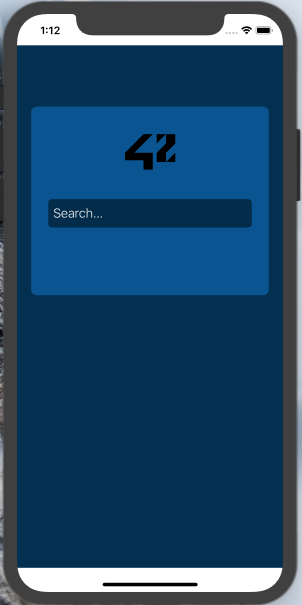
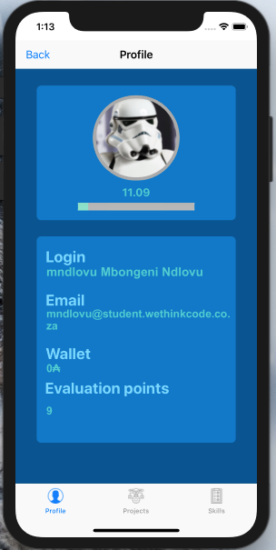
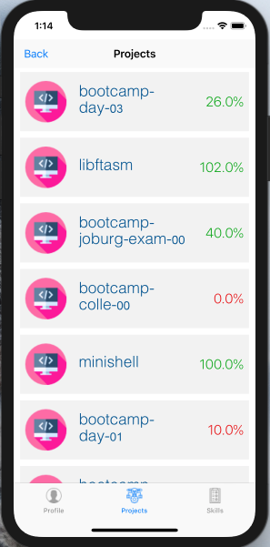
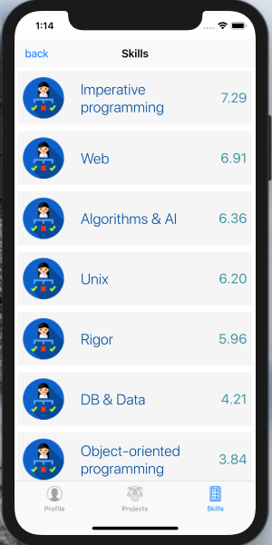

# Companion

The aim of the projet is to build an application that will retrieve the information of 42 student, using the 42 API. An API (Application programming interface) is a set of routines, protocols, and tools for building software applications. APIs often come in the form of a library that in- cludes specifications for routines, data structures, object classes, and variables. In other cases, notably SOAP and REST services, an API is simply a specification of remote calls exposed to the API consumers.

# Mendotory Part
The project must: 

1) have at least 2 Views.
2) The first view must contain an input text to search 42 logins.
3) The second view will display the login information.
4) It must at least display the profile picture and at least 4 other details (login, email, mobile, level, location, wallet, correction...).
5) It should display the skills with level and percentage.
6) It should display the projects user has done even if he has failed them.
7) Be able to go back to the first view.
8) This project must use Auto Layout.
9) Must not create a token for each query.

# Bonus
1) Use of custom cells - very recomended.
2) Recreate token at expire date.
3) Design
4) Scrollview

# Screanshots

